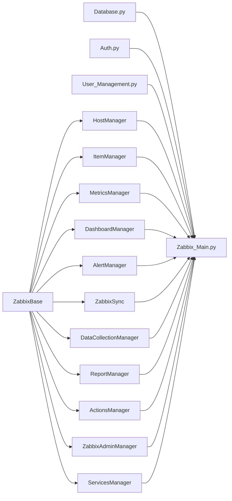

# CLAUDE.md

This file provides guidance to Claude Code (claude.ai/code) when working with code in this repository.

## Code conventions

- **Variables in code:** whenever you write a variable that the user needs to fill in (CI variables, image names, URLs, tokens, credentials, runner tags, etc.), always use a descriptive dummy name (e.g. `<your-kaniko-image>`, `staging-runner`, `STAGING_ARGOCD_TOKEN`) and add an inline comment explaining exactly what it is and where it needs to be changed. Never leave a variable placeholder without a comment.
- **Clean up after yourself:** delete any scratch/temporary files created while working on a task (analysis scripts, intermediate exports, one-off notes, throwaway output like a `mkdocs-export/`-style doc dump) before finishing — don't leave them sitting in the repo as clutter. If a file doesn't need to be committed, it doesn't belong in the working tree at all; put it somewhere outside the repo instead (e.g. `/tmp`, or a session scratch dir). Before finishing a task, run `git status --short` and make sure nothing unexpected/untracked was left behind. This repo has already accumulated junk this way before — e.g. a duplicate-named `apps/backend/.coverage 2` and `.claude/settings.local 2.json` both got committed by accident because their `" 2"` suffix (a macOS sync-conflict artifact) didn't match the `.gitignore` patterns for the real filenames.

## Code quality — mandatory baseline

Every change must keep the codebase at this quality level. Do not degrade any of these gates.

### Formatting — run after every edit

| Side | Formatter | Command (run from repo root) |
|------|-----------|------------------------------|
| **Backend** (`apps/backend/**/*.py`) | `ruff format` | `cd apps/backend && ruff format .` |
| **Frontend** (`apps/frontend/**/*.ts`, `*.tsx`) | `biome format` | `cd apps/frontend && npx biome format --write .` |

A `PostToolUse` hook runs both formatters automatically after every Edit/Write. Always verify with `ruff check .` (backend) and `npx biome check .` (frontend) before finishing a task. For import-ordering violations run `npx biome check --fix .` — it is always safe.

### Lint and typecheck — must pass clean

Run and fix before marking any task done:

```bash
# Backend
cd apps/backend && ruff check . && python3 -m mypy . --ignore-missing-imports

# Frontend
cd apps/frontend && npx biome check . && npx --no-install tsc --noEmit
```

Zero errors required. Do not suppress warnings with `# type: ignore` or `// biome-ignore` comments unless you quote the exact reason inline and there is genuinely no fix.

### SonarQube quality gates — maintain ≥ 80 %

The codebase is held to SonarQube's 80 % quality gate. Every new or changed file must comply:

| Category | Rule |
|----------|------|
| **Security** | No hardcoded credentials or secrets. Use `secrets.token_urlsafe()` for generated passwords. Never commit real tokens. |
| **Reliability** | No bare `except: pass` — always log with `logger.debug("...: %s", exc)`. No wrong return-type annotations. No dead unreachable code. |
| **Maintainability** | Keep cognitive complexity low. Extract helpers rather than deepening nesting. No large blocks of copy-pasted code — if the same pattern appears 3+ times, extract it. |
| **Duplication** | Shared logic belongs in shared modules (`api/deps.py` for backend route helpers, `src/app/components/` for reusable React components). Do not duplicate across files. |

These rules produced the helpers `resolve_team()`, `zabbix_call()` in `api/deps.py`, and the shared `ConfirmDelete` component — use those patterns as the reference.

### Run a local SonarQube scan after code edits

Whenever a task changes backend or frontend source (not pure doc-only edits), run a local scan before considering the task done — don't wait for CI to be the first place a new issue shows up. Requires Docker and a reachable SonarQube server.

```bash
docker run --rm \
  -e SONAR_HOST_URL="http://158.178.131.158:9000" \
  -v "$(pwd):/usr/src" \
  sonarsource/sonar-scanner-cli:latest \
  -Dsonar.login=<your-sonarqube-token> \
  # ^ generate one in the SonarQube UI under My Account > Security. This older
  # scanner-CLI/server combo needs -Dsonar.login, not -Dsonar.token.
  -Dsonar.host.url=http://158.178.131.158:9000
```

Run from the repo root (`sonar-project.properties` covers both `backend` and `frontend` modules). The scan takes a couple of minutes and typically backgrounds — after it reports `ANALYSIS SUCCESSFUL`, poll the printed task URL (`/api/ce/task?id=<taskId>`) until `status` is `SUCCESS`, then check for anything newly introduced:

```bash
curl -s -u "<token>:" "http://158.178.131.158:9000/api/issues/search?componentKeys=zabbix-portal&statuses=OPEN,CONFIRMED,REOPENED&ps=100"
```

Fix anything the scan attributes to the files just touched before finishing the task. A pre-existing open issue in a file you didn't touch is not something to fix opportunistically mid-task — note it and move on, unless the user asks you to address it.

### Documentation — update it in the same task, always

**Docs are part of the change, not a follow-up.** Whenever you change behaviour, configuration, architecture, or the pipeline, update the affected `.md` files and `OVERWATCH_USER_GUIDE.html` **in the same task, before reporting it done** — without waiting to be asked. A change that ships with stale docs is an incomplete change, exactly like one that fails lint.

Use this map to decide what to touch:

| What you changed | Docs that must be updated |
|------------------|---------------------------|
| A user-visible feature, screen, toggle, or workflow | `README.md` (Features list) **and** `OVERWATCH_USER_GUIDE.html` (the relevant section — plus §8 Troubleshooting if it introduces a new "why is it doing that?") |
| A REST route (added/removed/renamed/changed shape) | `README.md` (API endpoints section) |
| An environment variable or `.env` key | `README.md` (Environment files) + the env-var list in this file; `PRIVATE_NETWORK.md` if it is registry/air-gap related |
| Backend or frontend architecture, a manager, a shared pattern | this file (`CLAUDE.md`) — the architecture and "patterns" sections |
| A gotcha, invariant, or non-obvious constraint a future editor could break | this file, under "Things to know before editing" — state the **why**, not just the rule |
| CI pipeline: stages, jobs, CI variables | this file (GitLab CI section), `WORKFLOW.md`, `RELEASING.md`, `PRIVATE_NETWORK.md` (variable tables), and `OVERWATCH_USER_GUIDE.html` §7 |
| Helm/ArgoCD/cluster shape | the **GitOps repo** (charts live there), plus the Helm/GitOps section here |
| Local dev or Docker workflow | `DEVELOPMENT.md` + `README.md` (Quick start) |
| Roles, permissions, or auth behaviour | `README.md` (Roles / Authentication), `OVERWATCH_USER_GUIDE.html` §2 and §4 |

Rules that apply to every doc edit:

- **Never state something you have not verified in the code.** Read the actual source, CI file, or config first. Docs asserting a job name, variable, path, or default that does not exist are worse than no docs — they have already caused real drift in this repo.
- **Delete what is no longer true** in the same pass. Don't append a new paragraph beside a stale one and leave the reader to guess.
- If a change makes an existing doc statement wrong somewhere you were not asked to look, **fix it anyway** and say so in your summary.

`OVERWATCH_USER_GUIDE.html` has hard constraints — it is the end-user-facing guide, distributed and opened straight from disk on an air-gapped network:

- **Fully self-contained.** No CDN scripts, external stylesheets, web fonts, or remote images — ever. Inline everything; system font stack only.
- Its CSS custom properties intentionally mirror `apps/frontend/src/app/theme.ts` (signal-amber accent, graphite neutrals) so the guide looks like the product. Keep light **and** dark (`prefers-color-scheme`) in sync when restyling.
- Written for operators, not developers: describe what someone clicks and sees. Keep `kubectl`/CI detail confined to §7 and §8.
- After editing it, verify every `href="#…"` resolves to a real `id`, tags are balanced, and no external reference crept in.

---

## What this project is

A full-stack DevOps UI for managing a Zabbix monitoring server with role-based access control, team management, and a PostgreSQL user database. The backend exposes a REST API that wraps the Zabbix JSON-RPC API and manages users/teams; the frontend is a Next.js app that calls it. Primary operations: login/auth, manage teams and users, list/create/delete hosts, add many monitoring item types and triggers, bulk-import hosts from CSV/XLSX, export inventory to Excel, view live metrics & problems, build dashboards, define custom alert rules, manage data collection (template/host groups, templates, maintenance windows, event correlation, discovery rules), business services + SLAs, trigger/service/discovery actions with media types and scripts, reports (top triggers, Zabbix audit log, portal actions log, action log, availability, notifications), and Zabbix server administration (user groups, roles, API tokens, proxies, proxy groups, global macros, the item queue, and housekeeping/authentication settings).

The repo is set up for **air-gapped / private-registry** deployment on **OpenShift** (or vanilla Kubernetes) via **GitOps**. This repo builds container images only; it does **not** contain Helm charts or deploy to any cluster itself. On a tag push, CI builds the changed images and pushes updated image tags into a **separate GitOps repo**, where the Helm charts and ArgoCD `Application` manifests live. ArgoCD then syncs each environment from that repo — staging automatically, production and DR on manual approval.

---

## Monorepo layout

```
apps/
  backend/          Python 3.12 / FastAPI — Zabbix wrapper + PostgreSQL user/team DB
  frontend/         React 18 / Next.js 15 App Router / TypeScript / MUI
.gitlab/ci/         modular GitLab CI pipeline
docker-compose.yml  local orchestration (backend + frontend)
```

**There is no `helm/` or `argocd/` directory in this repo.** Helm charts, per-environment values, and ArgoCD `Application` manifests all live in the separate GitOps repo (`GITOPS_REPO_URL`). If you need to change in-cluster behaviour — resources, probes, env vars, Routes, replica counts — that change belongs in the GitOps repo, not here. This repo's CI only builds images and writes new image tags into that repo.

PostgreSQL is a **shared/external** database — it is not in `apps/` and is not deployed by the charts. The backend connects to it via `DATABASE_URL`.

---

## Development commands

### Backend (from `apps/backend/`)

```bash
python -m venv .venv && source .venv/bin/activate
pip install -r requirements.txt

# Dev server (port 6769)
uvicorn Zabbix_Main:app --host 0.0.0.0 --port 6769 --reload

# Lint / format
ruff check . && ruff format --check .

# Type-check
mypy . --ignore-missing-imports
```

### Frontend (from `apps/frontend/`)

```bash
npm install

# Dev server (Next.js on :42069, proxies /api → :6769 via route handler)
npm run dev

# Build / lint / typecheck
npm run build       # next build
npm run lint        # Biome
npm run typecheck   # tsc

# Format whole repo (from repo root)
npm run format
```

### Docker (each app built independently)

```bash
# Backend — build context is apps/backend/
docker build -t zabbix-portal-backend apps/backend/

# Frontend — build context is apps/frontend/ (Dockerfile lives there)
docker build -t zabbix-portal-frontend apps/frontend/
```

The easiest way to run both app services together is docker compose from the repo root:

```bash
# Build and start backend + frontend (PostgreSQL is external — set DATABASE_URL)
docker compose up -d --build

# Tear down
docker compose down
```

The two services share the default compose network and reach each other by container name. PostgreSQL is not part of compose — point `DATABASE_URL` at the shared database.

To run containers individually without docker compose:

```bash
docker network create zabbix-net

docker run -d --name backend --network zabbix-net \
  --env-file apps/backend/.env \
  -p 6769:6769 \
  zabbix-portal-backend

docker run -d --name frontend --network zabbix-net \
  -p 42069:42069 \
  zabbix-portal-frontend
```

Set `BACKEND_URL=http://backend:6769` in `apps/frontend/.env` when both containers are on the same network, and point `DATABASE_URL` in `apps/backend/.env` at your shared PostgreSQL (use its reachable host/IP, not `localhost`).

---

## Backend architecture



- **`ZabbixBase`** (in `Zabbix_Base.py`) loads `apps/backend/.env` and creates a `zabbix_utils.ZabbixAPI` session. All Zabbix managers inherit from it. `self.zapi` is `None` when Zabbix is unreachable — callers must guard against this. Exposes `close()`; honours `ZABBIX_SSL_VERIFY`. **Not every manager's `close()` is called on shutdown** — see "Things to know before editing".
- **`HostManager`** wraps host CRUD and Excel export (`openpyxl` / `pandas`).
- **`ItemManager`** wraps item and trigger creation across ~20 item types (agent, HTTP, SNMP, SNMP trap, internal, trapper, external, IPMI, SSH, telnet, JMX, calculated, dependent, Zabbix script, browser, ODBC/Agent2 DB monitors, file watch, service check). Trigger expressions pick their syntax from `self._zabbix_version` (set in `ZabbixBase`): `last(/hostname/item_key) operator threshold` on Zabbix ≥6.2, `{hostname:item_key.last()} operator threshold` (classic) below that.
  - **Auto-create-trigger toggle** — every item-add function/route/panel (except template items) supports an optional `create_trigger` flag, dispatched through `Item_Manager/triggers.py`'s `maybe_create_trigger()`. It picks the trigger type from the item's `value_type`: numeric (Float/Integer) gets `add_trigger()` (a real `operator`/`threshold` comparison) when `trigger_threshold` is given; string/log/text gets `add_string_trigger()` (a `like`/`notlike`/`regexp`/`notregexp` pattern match via `find(/host/key,,"op","pattern")=1`) when `trigger_pattern` is given. Leaving the threshold/pattern blank on either side falls back to `add_nodata_trigger()` — a `nodata(/host/key,5m)=1` trigger — since some numeric-looking items (an HTTP check or process-up item resolving to 0/1) have nothing meaningful to threshold against but still benefit from "stopped reporting" alerting. Frontend: the toggle + its conditional fields live in one shared `TriggerToggleFields` component (`apps/frontend/src/views/Items/panels/shared.tsx`), driven by `useCommonItemState()`'s `triggerFields()` helper — spread `...common.triggerFields()` into the `api.add*Item()` call, don't hand-wire the six fields per panel. **`ServiceFilePanel.tsx`'s three panels (Process, Windows Service, File Watch) are the deliberate exception** — they predate this toggle and already have their own bespoke trigger types (process/service "down" detection, file change/age triggers) that don't fit the generic threshold/pattern/nodata model; don't migrate them onto `TriggerToggleFields`. Failures creating the trigger are logged but never block the item itself from being reported as created (matches the pre-existing behavior of `add_process_item`/`add_windows_service_item`), except for `add_http_item`/`add_service_item`/etc. still returning a 2-tuple `(item_id, error)` — there is no `triggerid`/`trigger_error` in the API response for these ~19 types, unlike `add_file_watch_item`'s route-level handling.
- **`MetricsManager`** reads active problems (with acknowledgement audit), item history time-series, and historical problem windows from Zabbix. `acknowledge_problem()` and `unacknowledge_problem()` both call `zapi.event.acknowledge()` with Zabbix's action bitmask (`2`=acknowledge, `16`=unacknowledge, `4`=add message — acknowledge always sends `6`, unacknowledge always sends `20`, both unconditionally attaching a message so the actor is recorded in Zabbix's own event log too). Unacknowledge is exposed at `POST /metrics/problems/{eventid}/unacknowledge`, gated by `require_admin` (Team Lead+) — acknowledging is open to any authenticated user with host access, but reopening a problem is deliberately more restricted.
- **`DashboardManager`** lists native Zabbix graphs, proxies graph images, returns Chart.js series, and aggregates per-host last-value metrics.
- **`AlertManager`** owns user-defined alert rules and events. Its `run_checks()` runs on a background thread on an interval controlled by `ALERT_CHECK_INTERVAL` (default 15s, minimum 5s), evaluating thresholds and recording ok→firing transitions.
- **`ZabbixSync`** performs bidirectional user/group/host-group sync between the portal DB and Zabbix, including real-time sync via a PostgreSQL `LISTEN/NOTIFY` channel and a periodic background sync.
- **`DataCollectionManager`** wraps template groups, host groups, templates, maintenance windows, event correlation rules, and discovery rules (list/create/update/delete).
- **`ReportManager`** is read-only: top-100 triggers by problem count, the Zabbix audit log, the action log, notification history, and per-host-group availability. The Zabbix audit log always attributes writes to the single shared `ZABBIX_USER` service account (see `ZabbixBase`), never the real portal user — for accurate per-user attribution use the separate `Audit_Log.py` (portal-side, see below), surfaced as the "Portal Actions" report tab. `get_availability()` takes either `hours` (relative window ending "now", used by the report's 1h/6h/24h/7d/30d preset buttons) or an explicit `time_from`/`time_to` epoch-second pair (used by its From/To month-range picker, capped server-side at ~190 days in `api/routes/reports.py`) — the two are mutually exclusive, and only the explicit range constrains `problem.get`'s `time_till`, since the presets intentionally have no upper bound. A still-open problem's downtime is clamped to the range's end (`time_to`), not `now` — otherwise a past month's report would overstate downtime for anything still unresolved today.
  - **Team scoping happens in the route, not the manager** — matching the established pattern in `triggers.py`'s `list_all_triggers` (`api/deps.py`'s `team_hostname_filter()`, post-filter, not a query param on the manager method). `/reports/top-triggers` and `/reports/availability` in `api/routes/reports.py` both call `team_hostname_filter(current_user)` and drop any row whose host isn't in the allowed set (root/auditor get `None` → unrestricted). **`/reports/audit-log`, `/reports/action-log`, and `/reports/notifications` are NOT team-scoped** — `ReportManager`'s underlying Zabbix calls for these (`auditlog.get`, `alert.get`) don't return a hostname per row (audit log's `resourcename` is the item/trigger's own name, not a host, for most resource types; action log and notification history are keyed to a Zabbix user + event, not a host), so there is no cheap, reliable field to filter on without resolving each entry's `eventid` back to a host via extra Zabbix calls. Don't assume these three are team-safe — audit-log is at least `require_admin`-gated, but action-log and notifications are open to any authenticated user regardless of team.
- **`ActionsManager`** wraps trigger/service/discovery/autoregistration/internal actions, media types, and scripts (list/create/delete/toggle).
- **`ZabbixAdminManager`** wraps Zabbix server administration: user groups, a read-only Zabbix user list, user roles, API tokens, proxies, proxy groups (Zabbix 7.x), global macros, authentication settings, the item processing queue, and housekeeping settings.
- **`ServicesManager`** wraps business services, SLAs (with SLA reports), and "health monitor" items (simple URL/host checks surfaced as services).
- **`Database.py`** owns a `psycopg2.pool.ThreadedConnectionPool`, creates the schema on `init_db()`, and runs idempotent migrations. `get_conn()` returns a pooled connection whose `close()` returns it to the pool. Tables: `teams`, `team_users` (with `roles TEXT[]` and `restrictions TEXT[]`), `user_team_memberships` (many-to-many user↔team join, auto-migrated from `team_users.team_id` on startup), `host_assignments`, `dashboard_layouts`, `alert_rules`, `alert_events`, `problem_acknowledgements`, `problem_notes` (standalone comments on a problem, independent of acknowledging it — kept as its own table rather than a flag on `problem_acknowledgements` so the acknowledgement audit log stays semantically clean).
- **`Auth.py`** handles password hashing (`bcrypt`), JWT creation/validation (`python-jose`), and FastAPI dependency functions: `get_current_user`, `require_root`, `require_admin`, `require_operator`, plus the restriction-aware `require_item_write` / `require_trigger_write` / `require_hostgroup_write` (see "Things to know before editing" for how these compose). Also exports `can_grant_roles()` — the guard that prevents users from granting roles higher than their own.
- **`User_Management.py`** contains all SQL queries for users, teams, host assignments, dashboard layouts, and the overview aggregation. `seed_root()` seeds a root user on first startup from `ADMIN_USERNAME` / `ADMIN_PASSWORD` (default `Admin` / `admin`, with a logged warning if no password is set).
- **`Audit_Log.py`** owns the `portal_audit_log` table — `record_action()` / `list_actions()`. Populated entirely by the request middleware in `Zabbix_Main.py` (`_record_portal_audit`, run via `run_in_threadpool` since it's a blocking psycopg2 call inside an `async def` middleware), not by individual routes — every mutating request (`POST`/`PUT`/`PATCH`/`DELETE`, except `/auth/login`) is logged automatically by decoding the request's own JWT with `Auth.try_decode_token()` (a non-raising sibling of `_decode()` for use outside FastAPI's DI). This is the only accurate record of who did what in the portal — see the `ReportManager` note above for why Zabbix's own audit log can't do this. Retained 90 days, same as `alert_events`/`notification_history`.
- **`Zabbix_Main.py`** instantiates all 11 managers at module load (`host_bot`, `item_bot`, `metrics_bot`, `dashboard_bot`, `alert_bot`, `sync_bot`, `dc_bot`, `report_bot`, `actions_bot`, `zadmin_bot`, `services_bot`) and runs startup work (`init_db()`, `install_notify_triggers()`, `seed_root()`, sync bootstrap, alert-checker thread) inside a FastAPI **`lifespan`** context manager. All ~150 route handlers live here. There is no dependency injection.
- FastAPI runs on **port 6769** locally and in Docker/Kubernetes (`--workers 4` in the container image). Background threads (alert checker, realtime/periodic sync) acquire a cross-worker lock so they run in exactly one worker even with multiple uvicorn workers. A Server-Sent Events stream at `/events` pushes sync notifications to connected clients.

Required environment variables (in `apps/backend/.env`):

```
ZABBIX_URL=http://your-zabbix-server
ZABBIX_USER=Admin
ZABBIX_PASS=zabbix
ZABBIX_SSL_VERIFY=true        # set false only on a trusted net with a self-signed cert

DATABASE_URL=postgresql://postgres:postgres@<db-host>:5432/zabbix_portal

# Long random string — generate with: python -c "import secrets; print(secrets.token_hex(32))"
SECRET_KEY=change-me-in-production

ADMIN_USERNAME=Admin          # seed root username (first boot only)
ADMIN_PASSWORD=change-me      # seed root password; defaults to 'admin' with a warning if unset

BACKEND_URL=http://localhost:6769

# Comma-separated list of origins allowed to call the API (CORS). "*" (default) allows any.
ALLOWED_ORIGINS=http://localhost:42069

# Alert-rule evaluation interval in seconds. Default 15, minimum enforced 5.
ALERT_CHECK_INTERVAL=15
```

- `DATABASE_URL` — PostgreSQL connection string for the shared/external database. The backend creates the schema and runs migrations on every startup (idempotent).
- `ZABBIX_SSL_VERIFY` — TLS verification for the Zabbix API connection probe; `true` by default.
- `SECRET_KEY` — signs JWT tokens. **Must be changed before any real deployment.** If rotated, all existing tokens are immediately invalidated.
- `ADMIN_USERNAME` / `ADMIN_PASSWORD` — seed the root account on first boot only.
- `BACKEND_URL` — consumed by the frontend, not the backend itself — it lives here so there is one `.env` file to maintain.
- `ALLOWED_ORIGINS` — CORS allow-list, read once at import time. Local Docker needs the port (`http://localhost:42069`); in OpenShift use the Route hostname with no port (Routes serve on 443).
- `ALERT_CHECK_INTERVAL` — how often `AlertManager.run_checks()` evaluates rules on its background thread. Not currently exposed as a Helm value — set it via `config:`/`env:` in the umbrella chart if you need it in-cluster.

These can be supplied in two ways:
- **Local development** — place them in `apps/backend/.env` (loaded by `python-dotenv`).
- **Kubernetes / OpenShift** — inject them via a ConfigMap (non-sensitive values) or Secret (`ZABBIX_PASS`, `SECRET_KEY`, DB password). Mount via `envFrom`. Do not bake `.env` files into container images.

The Zabbix URL is normalised — either `http://host` or `http://host/api_jsonrpc.php` works.

---

## Frontend architecture

- All API calls go through the thin client in `src/app/api.ts`. Every call is prefixed with `/api` — all environments route through the same Next.js route handler. The client holds the JWT in `localStorage` and attaches it as a `Bearer` token on every request. On a 401 it clears the token and redirects to `/login` (except during the login call itself, which passes `{ skipRedirect: true }`).
- **API proxying** — `src/app/api/[...path]/route.ts` is a catch-all route handler that proxies every `/api/*` request to `BACKEND_URL` at request time. `BACKEND_URL` defaults to `http://localhost:6769` if not set.
- **`BACKEND_URL` loading** — `src/instrumentation.ts` runs `dotenv.config()` once at server startup, loading `apps/frontend/.env` (baked into the image at build time). In dev, Next.js loads `.env` automatically.
- **Auth context** — `src/app/context/AuthContext.tsx` holds the decoded JWT payload (`AuthUser`: `id`, `username`, `roles: string[]`, `team_id`). Consumed throughout the app via `useAuth()`.
- Routing: Next.js App Router (`src/app/`). Routes: `page.tsx` (/ → Overview), `dashboard/`, `hosts/`, `items/`, `triggers/`, `teams/`, `metrics/`, `users/`, `users-management/`, `data-collection/`, `services/`, `reports/`, `alerts-management/`, `administration/`, `login/`. Each thin page file re-exports the real view component from `src/views/` (`Overview`, `Dashboard`, `Hosts`, `Items`, `Triggers`, `Teams`, `Metrics`, `Users`, `UsersManagement`, `DataCollection`, `Services`, `Reports`, `AlertsManagement`, `Administration`, `Login`). Several routes are tab-driven via a `?tab=` query param read with `useSearchParams` (e.g. `/administration?tab=proxies`, `/data-collection?tab=templates`, `/metrics?tab=problems`) rather than separate pages per tab. There is also `src/middleware.ts` and `src/lib/auth.ts` for edge auth handling, and `SyncContext` (SSE) / `ThemeContext` providers.
- Root layout: `src/app/layout.tsx` (server component — html/body/AppRouterCacheProvider). Providers: `src/app/providers.tsx` (client boundary — ThemeProvider + AppShell). The login page bypasses AppShell.
- Theme: `src/app/theme.ts` (MUI v9, dark/light toggle persisted in `localStorage`).
- Shell: `src/app/layout/AppShell.tsx` — polls `/api/health` every **15 s** and shows live status dots (green/red) for Backend API and Zabbix in the top bar. Desktop navigation is a VS Code-style **activity rail** (56px icon-only, far left) + **section panel** (216px, a group's sub-pages as a vertical list — absent for groups with no sub-pages like Overview/Hosts). The section panel is collapsible: click the already-active rail icon again, or use the chevron in the panel's own header; a persistent `CollapsedPanelHandle` stays in its place so there's always a way back in. Mobile gets a hamburger-triggered `MobileNavDrawer` instead (rail+panel are desktop-only). The nav model (`navGroups` + `visibleNavGroups(roles)`) lives in `src/app/layout/nav.tsx`; the **Administration** group is hidden there for roles other than `root` / `team_lead` (the corresponding API endpoints are still independently gated server-side via `require_admin` / `require_root`, regardless of nav visibility). Which group is "active" for a given URL is resolved by `findActiveGroupId()` in `AppShell.tsx` — it checks every group for an exact, tab-aware match first and only falls back to a base-path guess (for bare links with no `?tab=`) if nothing matched exactly; do not reintroduce a per-group "does this path start with…" check without going through this function, since two groups sharing a base path with different tabs (e.g. Monitoring and Alerts both live under `/metrics`) will otherwise both show active at once.
- No global state manager — components call `api.*` directly.
- All page components are client components (`'use client'`) because they use React hooks and browser APIs.
- **All dates and times render through `src/app/datetime.ts`** — date is **DD/MM/YYYY**, time is **HH:MM:SS** on a 24-hour clock. Never call `toLocaleString` / `toLocaleDateString` / `toLocaleTimeString` in a view: their output follows the *viewer's* locale, so the same build renders `7/30/2026, 7:34 PM` for one operator and something else for the next — which is exactly the drift this module replaced (it consolidated ~8 near-duplicate formatters). Use `formatDate`, `formatTime`, `formatDateTime`, or `formatAxisTick`; they accept a `Date`, an ISO string, or a **Unix epoch in seconds** (Zabbix's `clock` convention — pass `p.clock`, not `p.clock * 1000`), and render `—` for null/0/unparseable input. `formatTimeShort` / `formatDateTimeCompact` exist only for dense chart axes where a seconds field would collide. One thing this cannot reach: `<input type="datetime-local">` (Maintenance windows, API token expiry) is rendered by the browser from OS locale and cannot be overridden from JS.
- **Per-browser user preferences live in `localStorage`, not the DB** — theme mode/direction, alert sound + preset, desktop-notification toggles, and the Problems tab's sort / "hide acked after" choices. They are therefore per-device and per-browser, never shared across users or synced server-side. If a preference genuinely needs to be org-wide, it belongs in `portal_settings` with a route in front of it (as `portal_ldap_config` does) — don't reach for `localStorage` for that.
- **Desktop notifications** — `src/app/layout/useSoundSettings.ts` owns the browser `Notification` API integration; `useAlertPolling.ts` calls its `showDesktopNotification()` on each new problem/alert-event poll (10 s). Two independent toggles in `AlertSoundMenu` (`AppShell.tsx`): "Desktop notifications" (`desktopNotif`, master on/off, greys out when the browser permission is `denied` since code cannot re-prompt after an explicit block) and "Keep notifications on screen" (`desktopNotifPersistent`, **defaults on**, sets the `requireInteraction` flag so Chrome/Windows pins the toast instead of auto-dismissing it after a few seconds). `requireInteraction` is a Chromium/Windows behaviour — Safari ignores it. Both require a secure context (`https://` or `localhost`); over plain `http://` the API is unavailable and the toggle silently does nothing.
- **Repeat-ring & snooze** — `useAlertPolling.ts` runs a separate 5-minute `setInterval` (`REPEAT_RING_INTERVAL_MS`) that re-plays the alert sound *and* re-pushes the still-ringing problems into the toast stack (`setNotifications`, deduped by `eventid`, capped at 8 like the regular poll) for any real Zabbix problem (`eventid` not prefixed `rule-`, since alert-rule events have no acknowledgement state) that is still unacknowledged and not snoozed, reading `activeProblems` via a ref kept in sync every render (same pattern as `soundRef` in `useSoundSettings.ts`) so the interval itself never needs to be torn down and recreated. The toast re-push exists specifically so a problem that predates page load (never got an initial toast — see below) or whose toast was already dismissed doesn't ring with nothing on screen to explain why. Snoozes are a plain `eventid → until-epoch-ms` map in `localStorage` (`problemSnoozeUntil`), not the DB — per-browser by design, same as other alert preferences. `NotifCard` (`NotificationCenter.tsx`) exposes the snooze menu (5/15/30/60 min) on the toast popup only; acknowledging a problem is what actually stops the repeat-ring, snoozing just silences it temporarily. Problems already active when the tab loads are deliberately marked "seen" on the first poll with no initial toast (`updateSeenProblemIds` in `useAlertPolling.ts`) — the repeat-ring is what eventually surfaces them if they're still unacknowledged 5 minutes later.
- **Problems tab** (`src/views/Metrics/ProblemsTab.tsx`) — the `useProblemsPreferences()` hook owns the persisted sort order and "hide acked after" duration, plus a 1 s `nowTick` that only runs while a hide timer is actually armed. Hiding is a **portal-side display filter keyed on `eventid`** (`isHiddenByAckTimer`) — nothing is closed in Zabbix, and because Zabbix issues a fresh `eventid` when a resolved problem re-triggers, a hidden problem reappears naturally on the next occurrence. `matchesProblemFilters` / `compareBySort` / `sortProblems` are deliberately module-scope functions, not closures, to keep the component under Biome's cognitive-complexity limit.
- **i18n** — `react-i18next` is installed and configured at `src/app/i18n/config.ts`. Translation files: `src/app/i18n/en.json` (English) and `src/app/i18n/he.json` (Hebrew stubs). ~45 view files use `useTranslation()` / `t()`. The Hebrew language switcher was built but is currently hidden — the infrastructure is in place to re-enable it (add EN/עב toggle to AppShell, load `@fontsource/heebo`, set RTL font in `theme.ts`). Direction switching (RTL/LTR) is wired through `ThemeContext.setDirection` and MUI `CacheProvider` with `stylis-plugin-rtl`.

### Frontend code style

- **Always use arrow-function syntax** for all functions — components, hooks, helpers, callbacks. Never use the `function` keyword.

```tsx
// correct
const MyComponent = () => { ... };
const useMyHook = () => { ... };
const handleClick = () => { ... };

// wrong — never do this
function MyComponent() { ... }
function useMyHook() { ... }
function handleClick() { ... }
```

### Frontend patterns — follow these everywhere

**Delete confirmations** — always use the shared `ConfirmDelete` component. Never use `window.confirm()` and never define a local Dialog just for deleting. Import from `../../app/components/ConfirmDelete` (or re-export it via the view's `shared.tsx`).

```tsx
// correct
import { ConfirmDelete } from "../../app/components/ConfirmDelete";
<ConfirmDelete open={open} name={item.name} onConfirm={handleDelete} onClose={() => setOpen(false)} />

// wrong
window.confirm(`Delete ${item.name}?`);
// wrong
<Dialog open={open}><DialogTitle>Delete?</DialogTitle>...</Dialog>  // inline one-off
```

**Toolbar layout** — every tab toolbar must follow this left-to-right order: search `TextField` (`sx={{ flex: 1 }}`), then filter dropdowns with fixed `minWidth`, then action icon buttons. Never put a `<Box sx={{ flex: 1 }} />` spacer between title and filters — the search field is the flex element.

```tsx
// correct
<Stack direction="row" spacing={1.5} sx={{ alignItems: "center" }}>
  <TextField placeholder="Search…" sx={{ flex: 1 }} slotProps={{ input: { startAdornment: <SearchIcon /> } }} />
  <FormControl size="small" sx={{ minWidth: 180 }}><InputLabel>Filter</InputLabel>...</FormControl>
  <IconButton><RefreshIcon /></IconButton>
</Stack>
```

**Type-only imports** — always use `import type` when importing only types. Biome enforces this; running `npx biome check --fix .` will auto-correct it.

```tsx
// correct
import type { MyType } from "./shared";
import { myHelper, type MyOtherType } from "./shared";
```

---

## Backend patterns — follow these everywhere

**Team resolution in route handlers** — never inline `live_team_id` + `um.get_team_name`. Use `resolve_team(current_user)` from `api.deps`:

```python
# correct
from api.deps import resolve_team
team_name = resolve_team(current_user)

# wrong
team_id = live_team_id(current_user)
team_name = um.get_team_name(team_id) if team_id else ""
```

**Zabbix manager calls in route handlers** — never write a bare `try/except RuntimeError` block. Use the `zabbix_call` context manager from `api.deps`:

```python
# correct
from api.deps import zabbix_call
with zabbix_call():
    result = some_bot.do_thing(...)
    return {"ok": True}

# wrong
try:
    result = some_bot.do_thing(...)
    return {"ok": True}
except RuntimeError as e:
    raise HTTPException(status_code=422, detail=zabbix_err(e))
```

**Zabbix API output fields** — always use `output="extend"` when calling `zapi.*`. Never pass a hardcoded list of field names — it breaks on Zabbix versions that don't have all those fields.

```python
# correct
result = self.zapi.proxy.get(output="extend")

# wrong
result = self.zapi.proxy.get(output=["proxyid", "name", "status"])
```

**Exception handling** — never silence exceptions with `except Exception: pass`. Always log them:

```python
# correct
except Exception as exc:
    logger.debug("Context about what failed: %s", exc)

# wrong
except Exception:
    pass
```

**Return type annotations** — all functions must have correct mypy-compatible return types. `-> None` on a function that returns a value is a mypy error. Run `python3 -m mypy . --ignore-missing-imports` before finishing.

---

## Private network / OpenShift conventions

- **Every `FROM` line** in Dockerfiles has a `# PRIVATE NETWORK:` comment with the exact image and the format for an Artifactory replacement. Do not change images without preserving these comments.
- **npm packages are pinned to exact versions** (no `^` or `~`) in `package.json` files, enforced by `save-exact=true` in `.npmrc`. **There are two `.npmrc` files, not one** — the root one and `apps/frontend/.npmrc` — because npm only reads the `.npmrc` in (or above) its current working directory *up to the nearest `package.json`*, and `apps/frontend/` has its own `package.json`, so installs run from there never see the root file. Keep both in sync; an install from `apps/frontend/` with only the root `.npmrc` present will silently save `^`-ranged versions. `npm ci` (used in Docker/CI) is what actually enforces a frozen lockfile — `.npmrc` itself does not have a frozen-lockfile setting. The commented-out `registry=` line in each is where to point at a private npm proxy.
- **`apps/frontend` uses `patch-package`** (devDependency, run via a `postinstall` script) to hard-patch a real bug in `@mui/material` — see the `Autocomplete`/`removeAttribute` entry under "Things to know before editing". In the air-gapped build, `patch-package` itself must be resolvable through the same private npm proxy as every other devDependency (nothing special beyond that — it's an ordinary npm package). `apps/frontend/patches/@mui+material+9.2.0.patch` must ship with the repo (it isn't a build artifact, don't gitignore it), and `apps/frontend/Dockerfile` copies `patches/` in before `npm ci` runs so the patch is present when `postinstall` fires.
- **pip packages** must be fetched from an internal PyPI proxy. The `pip install` line in `apps/backend/Dockerfile` has a commented `--index-url` variant ready to uncomment. The backend image is a **single-stage** build (installs deps, copies the app, `chown` for GID 0, `USER 1001`) — there is no separate `builder` stage to keep in sync.
- **`requirements.txt` is pinned to exact versions** (`==`, matching the npm convention above) — there is a single file, not a split prod/test one. A `requirements-test.txt` existed at one point with its own pins for `pytest`/`httpx` but was never referenced by the Dockerfile, CI, or anything else; it was deleted as dead weight rather than kept "just in case." Test-only packages (`pytest`, `pytest-cov`) still live directly in `requirements.txt` and therefore ship inside the production image too — that's accepted as-is (matches the single-stage build's existing simplicity), not something to "fix" by splitting files again without being asked.
- **`httpx` was replaced by `httpx2`** in `requirements.txt`. `httpx` 0.28.1 is its final release — the same maintainers moved development to a new package, `httpx2`. Nothing in this codebase imports `httpx` directly; it only mattered as what `starlette.testclient.TestClient` uses internally, and Starlette now emits `StarletteDeprecationWarning: Using httpx with starlette.testclient is deprecated; install httpx2 instead` if only the old package is present. Installing `httpx2` (no code changes needed — `TestClient` detects and prefers it automatically) clears the warning and all tests still pass. Don't reintroduce plain `httpx` as a dependency without a specific reason; there's no forward-looking upside to it now.
- The backend base image, `python:3.12-slim`, is a **floating** tag (auto-tracks the newest 3.12.x patch) — unlike the frontend's Node image, which was found hard-pinned to a specific stale patch (`node:22.2-alpine`) and had to be bumped. Nothing to fix here; don't "improve" it into an exact patch pin, that would be a regression back to the kind of staleness the Node fix corrected.
- The frontend runs on **port 42069** as a Next.js standalone server (`node server.js`). This is required for OpenShift's `restricted` SCC: non-root, unprivileged port, random UID with GID 0. Files are `chown 1001:0` so any UID in group 0 can read them.
- Don't add an nginx config in the frontend container — the standalone nginx image runs as root and binds port 80, both of which fail under the `restricted` SCC.

---

## Helm / GitOps repo (external)

The Helm charts are **not in this repo** — they live in the GitOps repo pointed at by `GITOPS_REPO_URL`, under `helm-charts/`, alongside `environments/{staging,production,dr}/values.yaml` and the ArgoCD `Application` manifests in `argocd/` (`application-staging.yaml`, `application-production.yaml`, `application-dr.yaml`). Chart edits, values changes, and cluster-shape changes are all made there, and that repo runs its own `helm lint` / `helm template` pipeline.

Facts that still matter from this side of the split:

- The frontend serves on port **42069** and the backend on **6769**; probes target `42069` on the frontend and `/health` on `6769` on the backend. Don't change either port here without updating the charts in the GitOps repo.
- In-cluster the Route/Ingress handles `/api/*` routing to the backend service, so the Next.js catch-all route handler's `BACKEND_URL` is **not** used there — it only matters for local dev and docker-compose.
- Sensitive Zabbix credentials and `SECRET_KEY` are expected to come from an existing Secret, and non-sensitive values (`ALLOWED_ORIGINS`, `BACKEND_URL`) from an existing ConfigMap, both created out-of-band in the cluster rather than rendered by the charts.
- PostgreSQL is shared/external and reached via `DATABASE_URL` from the backend's ConfigMap/Secret — nothing deploys it.
- `helm:lint` in this repo's pipeline is only a lightweight sanity check that runs when `HELM_CHANGED=1` and `HELM_IMAGE` happens to be set; real chart linting belongs to the GitOps repo's own pipeline.

---

## GitLab CI pipeline

`.gitlab-ci.yml` declares stages `[.pre, lint, build, promote, bootstrap]`, defines every non-sensitive CI variable as an editable placeholder in its own top-level `variables:` block, and includes **six** files from `.gitlab/ci/`:

- **`common.yml`** — two reusable job templates: `.base` (sets `tags: [$SHARED_RUNNERS_TAG]`) and `.docker_base` (extends `.base`, sets `image.name: $KANIKO_IMAGE`).
- **`detect.yml`** — `detect` diffs current tag vs. previous tag and emits `BACKEND_CHANGED` / `FRONTEND_CHANGED` / `HELM_CHANGED` plus a comma-separated `CHANGED_APPS` dotenv var (downstream jobs skip when their app is untouched). `validate:variables` hard-fails if any required CI variable is missing.
- **`python.yml`** — ruff lint, mypy, Kaniko build + push of the backend image to `$ARTIFACTORY_REGISTRY/backend:<tag>`.
- **`node.yml`** — Biome lint, tsc typecheck, Kaniko build + push of the frontend image to `$ARTIFACTORY_REGISTRY/frontend:<tag>`.
- **`sonarqube.yml`** — `sonarqube:scan` in the `lint` stage, using `$SONAR_SCANNER_IMAGE` against `$SONAR_HOST_URL`. Currently `allow_failure: true` (non-blocking, like the other lint jobs) — flip that to `false` once the gate is tuned.
- **`gitops.yml`** — `yamllint` + the optional `helm:lint` sanity check in `lint`, then the two deployment-facing stages:
  - **`push-image-tags`** (`promote`) — clones the GitOps repo, rewrites the image tag in `environments/{staging,production,dr}/values.yaml` for each changed app, commits, and pushes to `main`. Exits early as a no-op when `CHANGED_APPS` is empty. This is the only job that writes to the GitOps repo.
  - **`argocd:bootstrap:{staging,production,dr}`** (`bootstrap`) — idempotently upserts each environment's ArgoCD `Application` via the ArgoCD REST API, so the App exists/updates in the cluster without a human clicking through the ArgoCD UI. Staging runs automatically (`AUTO_SYNC: "true"`); **production and DR are `when: manual` gates** (`AUTO_SYNC: "false"`).

Actual cluster rollout is ArgoCD's job, not the pipeline's: staging auto-syncs on the new tag, while production and DR show as OutOfSync until someone syncs them. **Each environment has its own ArgoCD server and token** — DR is not a fallback to production's.

The pipeline fires **only on tag pushes** (or `FORCE_BUILD=1` from a branch). Branch pushes and MR merges do nothing. Required CI variables, all hard-checked by `validate:variables`: `SHARED_RUNNERS_TAG`, `KANIKO_IMAGE`, `PYTHON_IMAGE`, `NODE_IMAGE`, `GIT_IMAGE`, `ARTIFACTORY_REGISTRY`, `PROJECT_NAME`, `GITOPS_REPO_URL`, `GITOPS_TOKEN`, `SONAR_HOST_URL`, `SONAR_SCANNER_IMAGE`, `SONAR_TOKEN`, `STAGING_ARGOCD_SERVER`, `PROD_ARGOCD_SERVER`, `DR_ARGOCD_SERVER`. The masked tokens (`GITOPS_TOKEN`, `SONAR_TOKEN`, `STAGING_ARGOCD_TOKEN`, `PROD_ARGOCD_TOKEN`, `DR_ARGOCD_TOKEN`) must be real masked/protected GitLab CI/CD Variables — the `*_ARGOCD_TOKEN`s are deliberately not checkable in `validate:variables` because masking hides them. `HELM_IMAGE` is defined but **not** required — it only gates the optional `helm:lint` sanity check.

`GIT_IMAGE` must contain **git + yq + curl** — `push-image-tags` and the bootstrap jobs all rely on all three.

---

## Image strategy

- **`:vX.Y.Z`** — the only tag pushed, for apps that changed since the previous tag (short SHA on a `FORCE_BUILD`). There is no `:latest` tag.
- Every environment is pinned to an explicit tag written into its `values.yaml` in the GitOps repo. Production and DR never auto-update — the tag lands in Git immediately, but ArgoCD only applies it once someone syncs those environments.

---

## Things to know before editing

- The frontend Docker build context is `apps/frontend/` — the Dockerfile lives there and uses plain `npm ci`.
- `apps/frontend/.env` is baked into the frontend image at build time (not excluded by `.dockerignore`). Update it before building the image when the backend address changes. Exception: `REFRESH_INTERVAL` is read at runtime via the `/api/config` server route — it can be changed in the OpenShift Secret without rebuilding the image.
- `SECRET_KEY` in `apps/backend/.env` must be a long random string in any real deployment. Rotating it invalidates all existing JWT sessions immediately.
- The database schema is created and migrated automatically on every backend startup (`init_db()` in `Database.py`). Migrations are idempotent — safe to run against existing data. No manual migration step is needed.
- On first startup the backend seeds a root user from `ADMIN_USERNAME` / `ADMIN_PASSWORD` (default `Admin` / `admin`, with a logged warning if no password is set). This account must have its password changed before the system is used in any real environment.
- Roles are stored as a PostgreSQL `TEXT[]` array in `team_users.roles`. A user can hold multiple roles simultaneously. The JWT `roles` claim is a JSON array.
- A user can belong to multiple teams simultaneously via the `user_team_memberships` join table. `team_hostname_filter()` in `api/deps.py` returns the union of hosts from all the user's teams. The TeamCard "Add Member" button adds to `user_team_memberships`; the trash icon removes from it (never deletes the user account). `team_users.team_id` is kept for backward compatibility and as the "home team" for JWT display purposes.
- `can_grant_roles()` in `Auth.py` is enforced on both `POST /users` and `PUT /users/{id}`. It prevents any user from granting a role higher than their own. Only `root` can grant `auditor`.
- **Per-user write restrictions** live in a separate `team_users.restrictions TEXT[]` column and JWT `restrictions` claim — deliberately kept out of `roles` so the tokens (`hostgroups`, `items`, `triggers`) never leak into the many places that render `roles` as chips (Users list, Team cards, top-bar user menu). `Auth.RESTRICTION_TOKENS` is the whitelist; `api/routes/users.py`'s `_clean_restrictions()` drops anything else before it reaches the DB. Enforcement is via `Auth._restricted()`, which wraps a base role dependency: `require_item_write`/`require_trigger_write` wrap `require_operator` and gate every write route in `api/routes/items.py` and `api/routes/triggers.py`; `require_hostgroup_write` wraps `require_admin` and gates the four host-group CRUD routes in `api/routes/data_collection.py` (template groups, templates, maintenance, correlation, and discovery rules are unaffected — still plain `require_admin`). `root` always bypasses restrictions regardless of the column's contents. Restrictions are edited via a `RestrictionPicker` (`apps/frontend/src/views/Users/RestrictionPicker.tsx`) shown under the `RolePicker` in the Create/Edit User dialogs, grouped into "Data Collection" (Host Groups) and "Monitoring" (Items, Triggers) sections. Restrictions are personal only — unlike roles, they are not unioned with team-level grants in `get_effective_roles()`.
- **Username case is handled by the lookup, not by lowercasing the input.** `um.get_user_by_username()` matches on `LOWER(username) = LOWER(%s)`, so any casing resolves to the same account. Accounts the portal **creates** are stored lowercase (`create_user()` in `api/routes/users.py`, and the JIT-provisioning call in `api/routes/auth.py`) so new rows have one canonical form; rows written by other sources keep their original casing — `seed_root()` stores `Admin`, and `ZabbixSync` stores the Zabbix login verbatim.
  - Why it is split this way: LDAP/AD matches usernames case-insensitively, so before the case-insensitive lookup existed, signing in as `IdOkUlI` missed the stored `idokuli`, fell through to JIT provisioning, and silently created a **duplicate** account for one directory user.
  - **Do not "fix" this by lowercasing the login input** — that was tried and it locked out the seeded root account (`Admin`) and every Zabbix-synced user with capitals, returning 401 with no way in. Case-insensitivity belongs in the query.
  - The DB has no case-insensitive unique index, so `Admin` and `admin` *could* both exist on an old database; the lookup would then return whichever row Postgres yields first. Adding `CREATE UNIQUE INDEX … ON team_users (LOWER(username))` would prevent that, but it fails on a database that already contains such a pair — de-duplicate first, and never add it as an unconditional startup migration.
- Helm values that drive in-cluster behaviour live in the **GitOps repo**, not here — change them there and bump the chart's `version:` in its `Chart.yaml` in that repo. A change made only in this repo will never reach a cluster.
- Don't reintroduce nginx in the frontend container without thinking through OpenShift compatibility — the standard nginx image runs as root and binds port 80, both of which fail under the `restricted` SCC.
- Don't change `package.json` versions to `^x.y.z` ranges — exact pinning matters in this air-gapped environment.
- **MUI is v9** (upgraded from v5 in this session, along with `@mui/x-data-grid` to v9 and React to 19 / Next to 16). Several props that used to be plain JSX attributes are gone in v9 — this is the single most common way new code will fail to compile after this migration:
  - `Stack`/`Typography`/etc. lost their "system props" shorthand (`alignItems`, `justifyContent`, `flexWrap`, `gap`, `mb`, `fontWeight`, `fontSize`, ...) as direct JSX attributes. They must go inside `sx={{ ... }}` instead — e.g. `<Stack alignItems="center">` → `<Stack sx={{ alignItems: "center" }}>`. `Typography`'s dedicated `color` prop (theme palette keys) is unaffected and stays a direct prop.
  - `TextField`'s `InputProps` → `slotProps={{ input: {...} }}`; `inputProps` → `slotProps={{ htmlInput: {...} }}`; `InputLabelProps` → `slotProps={{ inputLabel: {...} }}`.
  - `Dialog`/`Drawer`'s `PaperProps` → `slotProps={{ paper: {...} }}`.
  - `ListItemText`'s `primaryTypographyProps`/`secondaryTypographyProps` → `slotProps={{ primary: {...} }}`/`slotProps={{ secondary: {...} }}` — and since the `primary`/`secondary` slot is itself a `Typography`, style-only keys (`fontSize`, `fontWeight`) inside it must be nested one level further under `sx`: `slotProps={{ primary: { sx: { fontSize: "0.8rem" } } }}`, while real `TypographyProps` like `color` stay a sibling of `sx`, not inside it.
  - `Tabs`' `TabIndicatorProps` → `slotProps={{ indicator: {...} }}`.
  - `Autocomplete`'s `renderTags` was renamed `renderValue`, and its second callback argument `getTagProps` is now `getItemProps` (same call shape: `getItemProps({ index })`). `AutocompleteRenderInputParams` (the object `renderInput` receives) no longer has `.InputProps`/`.InputLabelProps`/`.inputProps` — they moved to `.slotProps.input`/`.slotProps.inputLabel`/`.slotProps.htmlInput`. **If you spread `{...params}` onto the `<TextField>` inside `renderInput`, it must come *before* your own `slotProps={{...}}`** — `params` itself now carries a `slotProps` key, and a later spread silently overwrites an earlier explicit prop of the same name (caught as `'slotProps' is specified more than once` by `tsc`, but only because it's a duplicate JSX attribute; nothing warns you here if the ordering is swapped and the spread comes second).
  - `Grid`'s `item` prop is gone; `xs`/`sm`/`md`/`lg`/`xl` collapsed into one `size` prop: `<Grid item xs={12} md={6}>` → `<Grid size={{ xs: 12, md: 6 }}>`.
  - A handful of icon names lost their bare form and now only exist with an explicit style suffix, e.g. `@mui/icons-material/DeleteOutline` → `@mui/icons-material/DeleteOutlineOutlined` (also hit: `AddCircleOutline`, `CheckCircleOutline`, `ErrorOutline`, `StarOutline` — same pattern, append `Outlined`). If `tsc` reports `Cannot find module '@mui/icons-material/X'`, try `X` + `Outlined` before assuming the icon was removed entirely.
  - A multi-select `<Select multiple value={arr}>` may fail to infer its generic from `value` alone in some call shapes; if `tsc` complains the value type doesn't match a plain `string`, pin it explicitly: `<Select<string[]> multiple ...>`.
- **`@mui/material`'s `Autocomplete` (via `useAutocomplete.js`) had a real upstream null-ref bug** that surfaced as a full-page crash: `Cannot read properties of null (reading 'removeAttribute')`. Verified present in every published version from v5.18.0 through v9.3.1 (pulled and inspected each package directly, including 7.x and 8.x — 8.x doesn't exist as a release at all) — v9.1.0+ has a guard before the crashing line, `if (inputRef.current == null && listboxRef.current == null) return;`, but it only bails when **both** refs are null; if just `inputRef.current` goes null (e.g. the `<input>` unmounts because its `Dialog` is closing) while `listboxRef.current` is still non-null (the Popper-portal listbox has separate unmount timing), it falls through to `inputRef.current.removeAttribute(...)` and throws. v5.18.0–v9.0.1 and 7.x have **no guard at all** before that call — strictly worse. **There is no version to upgrade or downgrade to that avoids this** — confirmed directly against the source of every major line, don't re-litigate it without pulling the target version's `useAutocomplete.js` yourself (`npm pack @mui/material@<version>` and grep for `removeAttribute`).
  - The effect that reaches this code re-fires on two things: the `options` array changing, and `popupOpen` toggling (which happens on every single selection unless `disableCloseOnSelect` is set, since that's `false` by default even in `multiple` mode). This repo hit it hardest in the "add hosts to a host group" / "add templates to a template group" flow: `HostGroupsTab.tsx`/`TemplateGroupsTab.tsx` open the dialog immediately, then apply an async-fetched host/template list to the `Autocomplete`'s `options` a moment later — if the dialog is closed while that fetch is still in flight, the late `setState` changes `options` on an `Autocomplete` that may be mid-unmount, hitting the exact race the guard fails to cover.
  - **Now actually fixed, not just mitigated**, via `patch-package` — `apps/frontend/patches/@mui+material+9.2.0.patch` rewrites the guard in both `useAutocomplete.js` and `useAutocomplete.mjs` inside `node_modules/@mui/material` to check `inputRef.current` on its own before dereferencing it, instead of only bailing when both refs are simultaneously null. `package.json`'s `postinstall` script (`patch-package`) reapplies this automatically after every `npm install`/`npm ci`. **`apps/frontend/Dockerfile` copies `patches/` in before `RUN npm ci`** (a separate `COPY patches ./patches` ahead of the full `COPY . .`) — without that ordering, the patch silently isn't there yet when `postinstall` runs during the Docker build. If `@mui/material` is ever upgraded, regenerate the patch (`npx patch-package @mui/material` after re-applying the same manual edit) and rename the patch file to match the new version — a stale patch file for the wrong version will fail to apply and break every install.
  - The app-level mitigations from before the patch (`disableCloseOnSelect` on every `multiple` `Autocomplete`, plus the `openRequestRef` request-cancellation counter in `HostGroupsTab.tsx`/`TemplateGroupsTab.tsx`) are still in place and still worth keeping — they reduce churn regardless, and the patch only covers `@mui/material`'s own code, not equivalent bugs that could exist in other Autocomplete-like libraries introduced later.
- **`apps/frontend/src/app/providers.tsx` creates two standalone Emotion caches** (`ltrCache`/`rtlCache`, for RTL language switching via `stylis-plugin-rtl`) and both **must have `.compat = true` set** immediately after `createCache(...)`, mirroring what `@mui/material-nextjs`'s `AppRouterCacheProvider` sets on its own internal cache in `layout.tsx`. Without it, Emotion's SSR-only `Insertion` fallback renders literal `<style data-emotion="...">` elements as React children during server rendering (since these two caches aren't wired into `AppRouterCacheProvider`'s `useServerInsertedHTML` flush, they get Emotion's default behavior instead) — but the client build of the same component always returns `null`, since client-side insertion goes through `useInsertionEffect` instead. That mismatch triggers a hydration error on the very first styled element on any page (`Cannot read properties of null` is a different, unrelated bug above — this one is a `Hydration failed because the server rendered HTML didn't match the client` error). Confirmed by testing before/after in a live browser: without `.compat = true` the mismatch reproduces on every page load; with it, zero hydration errors. If you ever add a third custom Emotion cache anywhere in this app, it needs the same line.
- **TypeScript is v7** (the Go-based `tsgo` compiler). It passes `tsc --noEmit` fine on its own, but a plain `next build` fails with *"TypeScript 7.0.2 does not provide the compiler API required by Next.js"* — TS7 doesn't expose the old Program/LanguageService API Next's built-in type-checker calls into directly. Fixed by setting `experimental.useTypeScriptCli: true` in `next.config.ts`, which tells Next to shell out to the `tsc` CLI instead. **Do not remove that flag** — without it the production build breaks even though local `tsc` and `npm run typecheck` both look completely clean, which makes the failure easy to miss until `next build` is actually run.
- **`react-grid-layout` is v2** (Dashboard's Graphs tab and Metrics' Item Graphs tab both use it for the widget grid). v2 removed the `WidthProvider(ReactGridLayout)` HOC in favor of a `useContainerWidth()` hook, and replaced flat props with nested config objects. `src/app/components/AutoWidthGridLayout.tsx` restores the old HOC ergonomics (measures the container via the hook internally, renders nothing until `mounted`, so items don't flash at zero-width) — import `AutoWidthGridLayout` from there instead of touching `react-grid-layout`'s `WidthProvider` directly (it no longer exists). The prop mapping if you're touching either grid: `cols`/`rowHeight` → one `gridConfig={{ cols, rowHeight }}` object; `isDraggable`/`draggableHandle` → `dragConfig={{ enabled, handle }}`; `isResizable` → `resizeConfig={{ enabled }}`. `onLayoutChange`'s `layout` argument is now `readonly LayoutItem[]` (was a mutable array) — a handler that only reads from it doesn't need to change beyond widening its parameter type to `readonly {...}[]`.
- **The `lifespan` context manager lives in `api/lifespan.py`, not `Zabbix_Main.py`** — `Zabbix_Main.py` only imports it and passes it to `FastAPI(lifespan=lifespan)`. Its shutdown handler now closes **all 11** manager instances (this was previously only 6 — `dc_bot`, `report_bot`, `actions_bot`, `zadmin_bot`, and `services_bot` had been added after the original six and were missed; now fixed). If you add a 12th manager, add it to that same closing loop or it'll silently repeat this bug.
- **`pull_users()`/`bootstrap_teams()` and the background threads (alert checker, realtime/periodic sync, thread watchdog) all run in exactly one worker**, whichever wins the `_acquire_bg_lock()` file lock in `api/lifespan.py` — `init_db()`, `install_notify_triggers()`, and `um.seed_root()` still run on every worker (idempotent by design — `init_db()` needs its own advisory lock to actually be safe under concurrency, see below). This changed from an earlier version where `pull_users()`/`bootstrap_teams()` ran on every worker unconditionally: with `--workers 4`, `bootstrap_teams()` iterates every team's host assignments and calls `push_host_to_team()` per host, which does read-current-groups-then-INSERT-if-missing — four workers doing this concurrently for the same host+team could both read "not a member yet" before either write committed, so the second INSERT hit Zabbix's own `hosts_groups` uniqueness constraint and failed right after the same host+team had just been logged as successfully added. `push_host_to_team()` also has its own defense-in-depth fallback for this exact race (confirms the actual end state before treating a write failure as real, since a live "assign host" API call can still overlap the periodic/realtime sync even with single-worker startup) — don't remove that check when touching this method, and don't move `pull_users()`/`bootstrap_teams()` back outside the lock gate.
- **`install_notify_triggers()` in `Database.py` wraps its `CREATE OR REPLACE FUNCTION` in its own `SAVEPOINT`**, exactly like the per-table trigger loop right after it. Don't remove that savepoint: without it, a failure there aborts the whole transaction, and the (formerly unconditional) `pg_advisory_unlock`/`RESET lock_timeout` calls that followed would then *also* fail — since nothing can run on an aborted transaction without a rollback first — which masked the real error behind a generic `InFailedSqlTransaction` and, worse, left the session-scoped advisory lock held forever on that pooled connection, wedging every future call to this function until someone manually `pg_terminate_backend()`s it. If you ever see `install_notify_triggers failed (non-fatal): InFailedSqlTransaction` in the logs and every subsequent startup logs the same thing, that's this lock leaked from before this fix — find the idle session holding advisory lock `8472910234` in `pg_stat_activity`/`pg_locks` and terminate it.
- **`init_db()` in `Database.py` wraps its `CREATE TABLE IF NOT EXISTS` schema creation in a `pg_advisory_lock` (key `8472910233`)**, the same pattern as `install_notify_triggers()`'s lock (key `8472910234` — deliberately a different key so the two don't block each other). `IF NOT EXISTS` alone is not safe under concurrent execution: with `--workers 4`, all four workers call `init_db()` on startup, and two can both see a table as absent and both attempt the `CREATE` — one loses with `psycopg2.errors.DuplicateTable` or `UniqueViolation` on `pg_type_typname_nsp_index`, crashing that worker's startup. Unlike `install_notify_triggers()`, a failure here stays fatal (rolled back and re-raised) rather than logged-and-continued, since the app can't run without a valid schema — don't change that to a soft-fail. Don't remove the lock, and don't reuse its key for anything else.
- CORS is controlled by `ALLOWED_ORIGINS` (comma-separated, read once at import time in `Zabbix_Main.py`). Defaults to `*` if unset. It must come from the existing ConfigMap in the cluster (created out-of-band) or the env's `values.yaml` in the GitOps repo.
- When adding a new app to the pipeline: (1) add its build job CI file and `include:` it from `.gitlab-ci.yml`; (2) add its `_CHANGED` detection line to `detect.yml` so it also lands in `CHANGED_APPS`; (3) add its image-tag rewrite to `push-image-tags` in `gitops.yml`; (4) add the chart/dependency and per-env `values.yaml` entry in the **GitOps repo**.
- `push-image-tags` rewrites each changed app's tag independently — unchanged apps keep whatever tag is already committed in the env's `values.yaml`. Don't assume both apps move together on a release.
- **Zabbix UI elements in `RolesTab.tsx` (`Create role` dialog) are each gated to a minimum role `type`** — User (1), Admin (2), or Super admin (3) — via `minType` on the section and/or the individual item in `UI_SECTIONS`. Zabbix itself enforces this on `role.create`/`role.update` and rejects a mismatched element with `UI element "X" is not available for user role "Y"` — this bit us for real: `reports.audit_log`/`reports.action_log`/`reports.system_info`/`reports.scheduled_reports` need Super admin, `reports.notifications` needs Admin+, and the whole `Users`/`Administration` sections need Super admin (not just Admin — only Super admins manage other users in Zabbix). If you add a new report or admin-only UI element to `UI_SECTIONS`, set its `minType` correctly or role creation will fail for any type below it. `onAdd()` filters `form.ui_access` down to `visibleItemNames(form.type)` before submitting — don't send the raw `form.ui_access` state, since a role type switched down after checking higher-tier boxes leaves stale `true` entries in it that Zabbix will reject even though the checkboxes are no longer shown.

---

## Related docs

- [`README.md`](./README.md) — project overview and quick start
- [`WORKFLOW.md`](./WORKFLOW.md) — end-to-end development and CI/CD pipeline
- [`RELEASING.md`](./RELEASING.md) — release / rollback runbook
- [`PRIVATE_NETWORK.md`](./PRIVATE_NETWORK.md) — air-gapped configuration checklist
- [`DEVELOPMENT.md`](./DEVELOPMENT.md) — running the stack with Docker
- [`OVERWATCH_USER_GUIDE.html`](./OVERWATCH_USER_GUIDE.html) — the end-user guide shipped to operators (self-contained, air-gap safe — see the documentation rules above before editing)
