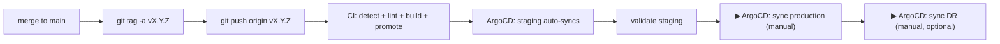

# Releasing

How to ship code changes — from a single bug-fix commit to a tagged production release.

> **The CI/CD pipeline runs ONLY on git tag pushes.** Branch pushes and merge requests do nothing in CI. The tag *is* the release. Until you tag, nothing is built, nothing is deployed.
>
> **Deployment uses a GitOps flow.** The CI pipeline pushes updated image tags to the `zabbix-portal-gitops` repo; ArgoCD syncs each cluster from there. Staging auto-syncs; production and DR require a manual sync click in the ArgoCD UI.

If you only want to understand what the pipeline does, read [`WORKFLOW.md`](./WORKFLOW.md). This document is a runbook — what commands to run, in what order, when something needs to ship.

---

## Quick reference

| I want to…                              | Do this                                                                                               |
| --------------------------------------- | ----------------------------------------------------------------------------------------------------- |
| Ship a release                          | Push a git tag — manually or via the workspace tool.                                                  |
| Roll production back                    | In ArgoCD: sync the Application to a previous Git revision, or pin the old tag in the GitOps repo.   |
| Hotfix production                       | Branch from the production tag → tag a new patch.                                                    |
| Bump only the Helm chart                | Edit the chart in the GitOps repo directly — no tag push needed here.                                |
| Validate locally before tagging         | `npm run lint && npm run typecheck` (frontend) + `ruff check . && mypy .` (backend).                 |

---

## 1. Prerequisites

Before your first release ensure:

- You have **Maintainer** access on the GitLab project.
- `RUNNER_TAG`, `KANIKO_IMAGE`, `PYTHON_IMAGE`, `NODE_IMAGE`, `HELM_IMAGE`, `GIT_IMAGE`, `ARTIFACTORY_REGISTRY`, `PROJECT_NAME`, and `GITOPS_REPO_URL` are filled in at the top of `.gitlab-ci.yml` (or overridden as GitLab CI/CD Variables).
- This secret is configured as a GitLab CI/CD Variable (Settings → CI/CD → Variables, masked + protected):
  - `GITOPS_DEPLOY_KEY` — private SSH key matching a Deploy Key with **write** access on the `zabbix-portal-gitops` repo.
- The container registry is reachable from the GitLab runners and from each cluster.
- ArgoCD is installed in the cluster and its `ApplicationSet` is applied from the GitOps repo.
- The Artifactory registry path is set via `ARTIFACTORY_REGISTRY` at the top of `.gitlab-ci.yml` — see [`PRIVATE_NETWORK.md`](./PRIVATE_NETWORK.md).

`validate:variables` in the `.pre` stage hard-fails the pipeline if any required variable above is missing, so a misconfiguration is caught before any build runs.

---

## 2. Standard release flow



### 2.1 Prepare your changes

Branch off `main`, make changes, push the branch, open an MR, get it reviewed, merge it. **None of these steps trigger CI.** They are all local / GitLab-side coordination.

```bash
git checkout main && git pull
git checkout -b feature/<short-description>
# ...edit code...

# Validate locally — same checks CI runs (when it eventually does)
cd apps/frontend && npm run lint && npm run typecheck
cd apps/backend  && ruff check . && mypy . --ignore-missing-imports
helm lint helm/charts/{backend,frontend,zabbix-portal}    # if you touched Helm

git commit -am "feat: <subject>"
git push -u origin feature/<short-description>
# ...open MR, review, squash-merge...
```

After a merge to `main` nothing happens automatically. The release happens only when you tag.

### 2.2 Cut the release tag

You have two ways to create the tag — pick whichever is more convenient.

#### Option A — manual `git tag`

```bash
git checkout main && git pull

# Annotated tag with a release note
git tag -a v1.4.0 -m "Release 1.4.0 — <one-line summary>"

# Push the tag — this is what fires CI
git push origin v1.4.0
```

#### Option B — npm version

```bash
# From apps/frontend/ or the repo root
npm version 1.4.0 -m "chore: release v%s" && git push --follow-tags
```

Whatever tool you use, the moment a tag lands on the remote, CI starts.

### 2.3 What CI does on the tag

1. **`detect`** (`.pre` stage) — compares the new tag against the previous ancestor tag and emits per-app `BACKEND_CHANGED` / `FRONTEND_CHANGED` flags. `validate:variables` checks required CI variables are set.
2. **`lint` stage** — yamllint, ruff, mypy, Biome, tsc run (yamllint always; app checks only for apps that changed).
3. **`build` stage** — Kaniko builds Docker images for changed apps and pushes them tagged `:<git-tag>`.
4. **`promote` stage** — `push-image-tags` clones the GitOps repo, updates `tag:` in `environments/{staging,production,dr}/values.yaml` for each changed app, and commits + pushes. ArgoCD detects the change and syncs each environment.

After the pipeline finishes:
- **Staging** — ArgoCD auto-syncs within seconds of the commit landing in the GitOps repo.
- **Production / DR** — ArgoCD shows OutOfSync. Open the ArgoCD UI and click **Sync** for each when you're ready.

### 2.4 Validate on staging

Spot-check the change in the staging UI. In the ArgoCD UI, confirm the staging Application is **Healthy** and **Synced**. To watch via kubectl:

```bash
kubectl -n zabbix-portal-staging rollout status deploy/zabbix-portal-staging-frontend
kubectl -n zabbix-portal-staging rollout status deploy/zabbix-portal-staging-backend
```

If something is wrong: see §6 to roll back, then fix and re-tag.

### 2.5 Promote to production

The `push-image-tags` job already updated the production `values.yaml` in the GitOps repo. ArgoCD is just waiting for you to approve the sync:

1. Open the ArgoCD UI.
2. Find the `zabbix-portal-production` Application — it will show **OutOfSync**.
3. Click **Sync** → confirm.

ArgoCD renders the Helm chart from the GitOps repo and applies the new manifests. Only apps whose tags changed will roll their pods. Unchanged apps are unaffected.

---

## 3. Versioning rules (semver)

`vMAJOR.MINOR.PATCH`. No pre-release suffixes — every tag is a real release.

| Change                                                  | Bump  |
| ------------------------------------------------------- | ----- |
| Breaking API change, breaking config / values change    | MAJOR |
| New feature, new API endpoint, new Helm value           | MINOR |
| Bug fix, security patch, dependency bump, doc-only      | PATCH |

### Helm chart versions

Helm charts now live in the `zabbix-portal-gitops` repo under `helm-charts/`. Two distinct fields in each `Chart.yaml`:

- **`version:`** — the Helm chart version. Bump on **any** chart change.
- **`appVersion:`** — the application version this chart was authored for.

When you cut release `v1.4.0`, update `appVersion: "1.4.0"` and bump `version:` in:

- `helm-charts/backend/Chart.yaml`
- `helm-charts/frontend/Chart.yaml`
- `helm-charts/zabbix-portal/Chart.yaml`

Commit those changes directly to the GitOps repo — no app tag push needed.

---

## 4. Hotfix flow

When production has a critical bug and `main` has unrelated unfinished work:

```bash
# Branch off the released tag, not main
git checkout v1.4.0
git checkout -b hotfix/v1.4.1

# ...minimal fix...
cd apps/frontend && npm run lint && npm run typecheck
cd apps/backend  && ruff check . && mypy . --ignore-missing-imports

git commit -am "fix: <subject>"
git push -u origin hotfix/v1.4.1

# Open MR targeting main, get it reviewed and merged (no CI runs)
# Then tag from the merge commit on main:
git checkout main && git pull
git tag -a v1.4.1 -m "Hotfix 1.4.1 — <subject>"
git push origin v1.4.1
```

The tag push is what fires CI. Detection diffs `v1.4.0..v1.4.1` and only the apps that actually changed get rebuilt. Click the manual production gate to ship.

---

## 5. Per-app releases

Per-app releases are automatic — no extra ceremony required. The detect job diffs the new tag against the previous tag and only the apps with actual code changes get rebuilt and re-pinned.

| Scenario                                              | Backend | Frontend |
| ----------------------------------------------------- | ------- | -------- |
| Tag with backend-only changes since last tag          | rebuilt | unchanged |
| Tag with frontend-only changes                        | unchanged | rebuilt |
| Tag with changes to both                              | rebuilt | rebuilt |
| Helm chart changes (in GitOps repo, no app code)      | unchanged | unchanged |
| First-ever tag (no previous tag to diff against)      | rebuilt | rebuilt |

In each deploy job, the same diff drives `helm --set image.tag`: only changed apps are pinned to the new tag. Unchanged apps keep the tag read back from `helm history`.

---

## 6. Rollback procedures

There is no automatic rollback. Production stays on whatever was last deployed, even if `main` advances.

### 6.1 Roll back via ArgoCD (recommended)

In the ArgoCD UI, open the Application → **History and Rollback** → select the previous revision → click **Rollback**. ArgoCD re-applies the chart and values from that Git revision, restoring the previously deployed image tags. This is the fastest path during an incident — no Git changes needed.

### 6.2 Roll back by editing the GitOps repo

Pin the old image tag directly in the GitOps repo:

```bash
# In zabbix-portal-gitops:
# Edit environments/production/values.yaml
# Set backend.image.tag and/or frontend.image.tag to the known-good version
git commit -am "revert: pin backend to v1.3.0 after bad deploy"
git push
```

ArgoCD detects the change and shows OutOfSync — click Sync to apply. For staging it applies automatically.

### 6.3 Roll back staging

In ArgoCD, use History and Rollback on the staging Application, or push a corrected tag to the GitOps repo — staging will auto-sync.

---

## 7. Pre-flight checklist before tagging

- [ ] Code merged to `main` and the tip of `main` builds locally
- [ ] `npm run lint && npm run typecheck` passes in `apps/frontend/`
- [ ] `ruff check . && mypy . --ignore-missing-imports` passes in `apps/backend/`
- [ ] Helm chart changes (if any) are already committed to the GitOps repo and pass its pipeline
- [ ] `Chart.yaml` `version:` and `appVersion:` are bumped in the GitOps repo (if charts changed)
- [ ] Any new Helm values are documented in `helm-charts/zabbix-portal/values.yaml` with comments
- [ ] Breaking changes are flagged in the tag annotation message
- [ ] At least one other maintainer has reviewed the diff against the previous tag:

  ```bash
  git log v1.3.0..main --oneline
  ```

- [ ] Database / external system migrations (if any) are already applied to production

When all true: create the tag, push it, then click the production gate when staging looks good.

---

## 8. Why tag-only?

In this repository, **only tags are releases**. There is no "auto-deploy on `main`" path. This is deliberate:

- `main` is allowed to be in flux — features can land without being immediately deployed to staging or production.
- Every deploy is intentional and traceable to a tag with a release note.
- Per-app detection always has a clean comparison base (`previous tag → current tag`), so noise from intermediate commits never enters the deploy decision.
- Rolling back is just `helm rollback` to a known-good revision — no need to revert commits in Git first.

If you want feature-branch previews or auto-deploys on `main`, that is a separate workflow you would add on top — not a replacement for this one.
