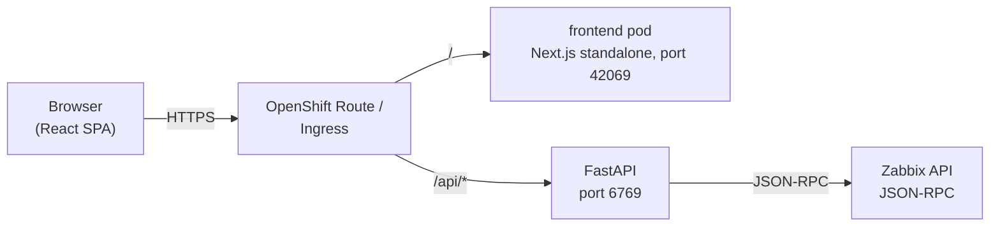
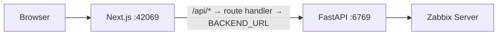
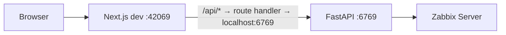
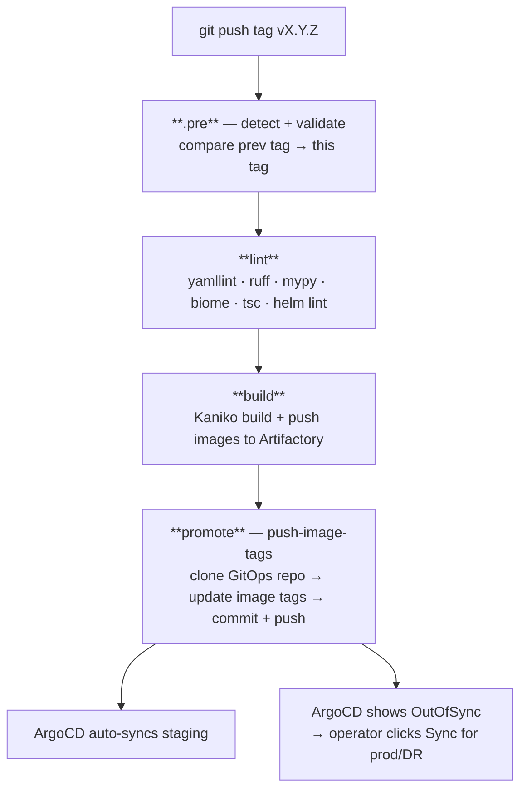
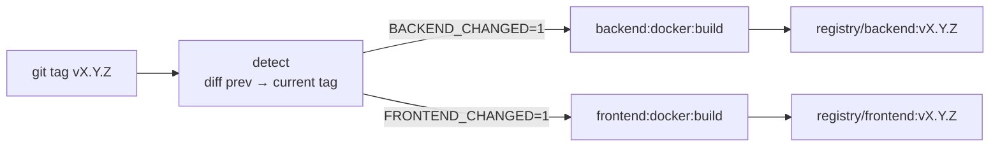
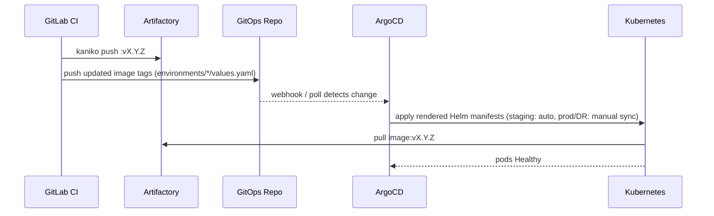
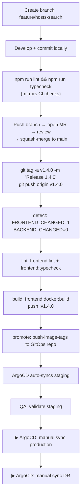

# Workflow

A complete walkthrough of how the Overwatch codebase moves from a developer's laptop into production. This document covers:

1. The runtime request flow (browser → frontend → backend → Zabbix)
2. The local development workflow
3. The Git branching model
4. The GitLab CI pipeline (every stage, every job, every trigger)
5. The container build and image strategy
6. The Helm deployment flow (staging / production / DR)
7. How a single code change traverses all of the above

> **Deployment uses a GitOps flow.**
> The CI pipeline pushes image tags to a separate `zabbix-portal-gitops` repo;
> ArgoCD watches that repo and syncs each environment. Staging auto-syncs;
> production and DR require a manual sync click in ArgoCD. See §6.

---

## 1. Runtime request flow

### In Kubernetes / OpenShift



- The Route/Ingress splits traffic by path: `/api/*` → backend, everything else → frontend.
- The frontend container does **not** proxy API calls in-cluster — routing is handled by the Route/Ingress.

### In standalone Docker (local)



- The browser hits the Next.js server directly.
- `/api/*` requests are proxied by the catch-all route handler at `src/app/api/[...path]/route.ts` to `BACKEND_URL` (read from `apps/frontend/.env` at server startup via `src/instrumentation.ts`).

### In local development



Same route handler, same `BACKEND_URL` mechanism — Next.js loads `.env` automatically during `npm run dev`.

### Real-time updates

The backend exposes a Server-Sent Events stream at `/events`. The frontend's `SyncContext` subscribes to it and re-fetches data whenever the backend completes a Zabbix sync, so the UI reflects external changes without a manual refresh.

---

## 2. Local development workflow

### First-time setup

PostgreSQL is a **shared/external** database — point `DATABASE_URL` at it. For a throwaway local DB:

```bash
# 1. Start a local PostgreSQL (or point DATABASE_URL at your shared instance)
docker run -d --name pg -p 5432:5432 \
  -e POSTGRES_USER=postgres -e POSTGRES_PASSWORD=postgres -e POSTGRES_DB=zabbix_portal \
  postgres:16

# 2. Create apps/backend/.env (see README.md — Environment files)
# 3. Create apps/frontend/.env with BACKEND_URL=http://localhost:6769
```

### Daily loop

```bash
# Option A — run both app containers with docker compose (from repo root)
#            (postgres is external — set DATABASE_URL in apps/backend/.env)
docker compose up -d --build

# Option B — run each service manually in separate terminals

# Terminal 1 — Backend (from apps/backend/)
source .venv/bin/activate
uvicorn Zabbix_Main:app --host 0.0.0.0 --port 6769 --reload

# Terminal 2 — Frontend (from apps/frontend/)
npm run dev   # Next.js on :42069
```

On first backend startup the schema is created automatically and a root user is seeded
(`ADMIN_USERNAME` / `ADMIN_PASSWORD`, default `Admin` / `admin`). Change the password after first login.

### Pre-commit checks

```bash
# From apps/frontend/
npm run lint       # Biome
npm run typecheck  # tsc

# From apps/backend/
ruff check . && mypy . --ignore-missing-imports
```

### Editing Helm charts

Helm charts now live in the `zabbix-portal-gitops` repo under `helm-charts/`. Edit them there — the GitOps repo's own pipeline runs `helm lint` and `helm template` on every push.

---

## 3. Git branching model

| Branch       | Purpose                                             | CI behaviour                              |
| ------------ | --------------------------------------------------- | ----------------------------------------- |
| `main`       | The single source of truth — merged, reviewed code  | **No CI.** Tags trigger CI, not branches. |
| `feature/*`  | Short-lived branches for new work                   | No CI. Validate locally before MR.        |
| `fix/*`      | Bug-fix branches                                    | Same as `feature/*`.                      |
| Tag `vX.Y.Z` | Immutable release marker on a `main` commit         | Full pipeline: lint → build → deploy.     |

Workflow: branch off `main` → develop → lint/typecheck locally → open MR → review → squash-merge to `main` → **tag** to release.

> **The tag is the release.** Branch pushes and MR merges do nothing in CI. Only a `git push origin vX.Y.Z` fires the pipeline.
> (`FORCE_BUILD=1` can be used to run a build/deploy from a branch without a tag — it falls back to the short SHA as the image tag.)

---

## 4. GitLab CI pipeline

The pipeline is modular. `.gitlab-ci.yml` declares stages and includes five files:

```yaml
stages: [.pre, lint, build, promote]
include:
  - .gitlab/ci/common.yml    # reusable job templates (runner tag, Kaniko base image)
  - .gitlab/ci/detect.yml    # change detection + variable validation
  - .gitlab/ci/python.yml    # backend jobs
  - .gitlab/ci/node.yml      # frontend jobs
  - .gitlab/ci/gitops.yml    # yamllint, helm lint, push-image-tags
```

### Pipeline overview



After `push-image-tags` commits updated tags to the GitOps repo, ArgoCD takes over:
- **Staging** — syncs automatically (automated syncPolicy).
- **Production / DR** — show OutOfSync in the ArgoCD UI; an operator triggers the sync manually.

### 4.1 Stage `.pre` — change detection + validation (`detect.yml`)

`detect` runs once at the start of every tag pipeline. It compares the current tag against the most recent ancestor tag and writes two booleans (+ the previous tag) to a dotenv artifact:

```
BACKEND_CHANGED=1
FRONTEND_CHANGED=0
PREV_TAG=v1.3.0
```

All downstream jobs consume these vars via `artifacts: reports: dotenv`. Jobs for unchanged apps are skipped entirely. On the first-ever tag (or with `FORCE_BUILD=1`) everything is marked changed.

`validate:variables` also runs in `.pre`. It prints all pipeline variables and **hard-fails** if any required variable (`GITOPS_REPO_URL`, `GITOPS_DEPLOY_KEY`, `ARTIFACTORY_REGISTRY`, etc.) is missing — surfacing misconfiguration early.

### 4.2 Stage `lint` — fast-fail static checks

| Job                  | Image              | Runs when            | What it does                               |
| -------------------- | ------------------ | -------------------- | ------------------------------------------ |
| `yamllint`           | internal Python    | always               | `yamllint` on all pipeline + compose YAMLs |
| `backend:lint`       | internal Python    | `BACKEND_CHANGED=1`  | `ruff check .` + `ruff format --check .`   |
| `backend:typecheck`  | internal Python    | `BACKEND_CHANGED=1`  | `mypy . --ignore-missing-imports`          |
| `frontend:lint`      | internal Node      | `FRONTEND_CHANGED=1` | `npm run lint` (Biome)                     |
| `frontend:typecheck` | internal Node      | `FRONTEND_CHANGED=1` | `npm run typecheck` (tsc)                  |
| `helm:lint`          | internal Helm      | always (no-op)       | placeholder — charts lint in the GitOps repo's own pipeline |

`backend:lint`, `backend:typecheck`, `frontend:lint`, and `frontend:typecheck` are currently `allow_failure: true` (advisory). `yamllint` runs on every tag and blocks if any pipeline YAML is malformed.

### 4.3 Stage `build` — produce images

Images are built with **Kaniko** (rootless, daemonless — works in restricted CI). Each image is pushed with a single tag: the release tag (`$CI_COMMIT_TAG`), or the short SHA on a `FORCE_BUILD`.

| Job                      | Runs when            | Output                                             |
| ------------------------ | -------------------- | -------------------------------------------------- |
| `backend:docker:build`   | `BACKEND_CHANGED=1`  | Pushes `<registry>/backend:$IMAGE_TAG`             |
| `frontend:docker:build`  | `FRONTEND_CHANGED=1` | Pushes `<registry>/frontend:$IMAGE_TAG`            |

Kaniko layer caching is enabled (`--cache=true --cache-ttl=1440h`).

### 4.4 Stage `promote` — update image tags in the GitOps repo

`push-image-tags` clones the `zabbix-portal-gitops` repo (via `GITOPS_DEPLOY_KEY`), updates the `tag:` line in `environments/{staging,production,dr}/values.yaml` for each changed app, then commits and pushes back. The commit message references the pipeline URL, commit SHA, and changed apps.

Only changed apps get a new tag — unchanged apps stay pinned to whatever was already in the values file. If neither app changed, the job exits cleanly with no commit.

---

## 5. Container build and image strategy



- Images are tagged **only** with the release tag (`vX.Y.Z`), or the short SHA for a `FORCE_BUILD`. There is no `:latest` tag.
- Production and DR are pinned to a specific tag via `helm --set image.tag=` and never auto-update.

### Backend Docker build

- Build context is `apps/backend/`.
- Single-stage: installs `requirements.txt`, copies the app, then `chown -R 1001:0` + `USER 1001` so any OpenShift-assigned UID in GID 0 can read the files (`restricted` SCC). Runs with `uvicorn ... --workers 4`.

### Frontend Docker build

- Build context is `apps/frontend/` — `docker build -t overwatch-frontend apps/frontend/`.
- Multi-stage: `builder` (`npm ci` + `next build`) → `runner` (Next.js standalone, `node server.js`, port 42069). Runs as non-root `USER 1001`.
- `apps/frontend/.env` is copied into the image and loaded at server startup by `src/instrumentation.ts` via `dotenv.config()`. Set `BACKEND_URL` before building. (In-cluster, the Route handles `/api/*` so this value is unused there.)

---

## 6. Deployment flow

### GitOps via ArgoCD



- Helm charts live in `zabbix-portal-gitops/helm-charts/`. ArgoCD renders them at sync time using each environment's `values.yaml`.
- **Staging** syncs automatically when values change. **Production and DR** show OutOfSync in the ArgoCD UI until an operator triggers a manual sync.
- Rollback: in ArgoCD, sync the application to a previous Git revision, or update the tag in `values.yaml` back to the old version and push.

---

## 7. End-to-end: a feature change

Walking through a change to `apps/frontend/src/views/Hosts.tsx`:



Key invariants:

- **Only changed apps rebuild.** If only `apps/frontend/` changed, backend jobs are skipped entirely.
- **Unchanged apps keep their deployed tag.** `push-image-tags` only writes tags for apps that changed.
- **Production never auto-updates.** Each promotion requires a manual sync click in ArgoCD.
- **Rollback is always available.** Sync ArgoCD to a previous Git revision, or pin the old tag in the GitOps repo. See `RELEASING.md`.
